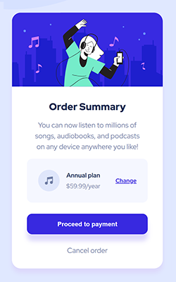

# Frontend Mentor - Order summary card solution

This is a solution to the [Order summary card challenge on Frontend Mentor](https://www.frontendmentor.io/challenges/order-summary-component-QlPmajDUj). Frontend Mentor challenges help you improve your coding skills by building realistic projects.

# Challenge description

This challenge involves building a simple and clean order summary card using HTML and CSS. The component displays a product summary with a plan selection, pricing, and a call-to-action button. It's a great exercise for practicing layout techniques, spacing, font styling, and responsive design.

## Table of contents

-   [Frontend Mentor - Order summary card solution](#frontend-mentor---order-summary-card-solution)
-   [Challenge description](#challenge-description)
    -   [Table of contents](#table-of-contents)
    -   [Overview](#overview)
        -   [The challenge](#the-challenge)
        -   [Screenshot](#screenshot)
        -   [Links](#links)
    -   [My process](#my-process)
        -   [Built with](#built-with)
        -   [What I learned](#what-i-learned)
        -   [Continued development](#continued-development)
        -   [Useful resources](#useful-resources)
    -   [Author](#author)
    -   [Acknowledgments](#acknowledgments)

## Overview

### The challenge

Users should be able to:

-   View the order summary component centered on the page

-   See hover states for interactive elements (e.g., buttons and links)

-   Switch to a different plan (if the button was functional — though this is static in the basic version)

-   View a responsive layout on smaller screens

### Screenshot

### Links

-   Solution URL: [Github] (https://github.com/usiemeblessing/order-summary-component)
-   Live Site URL: [Live site at Netlify](https://usiemeblessing-order-summary-comp.netlify.app)

## My process

I started by setting up the basic HTML structure, focusing on semantic elements. Then, I styled the component using CSS, paying close attention to spacing, typography, and alignment to match the design. I used Flexbox for centering and layout. Finally, I added responsive styling to ensure it looks good on smaller screens.

### Built with

-   Semantic HTML5 markup
-   CSS custom properties
-   Flexbox
-   Desktop-first workflow

### What I learned

-   How to structure a simple component using semantic HTML

-   Using Flexbox to center elements both vertically and horizontally

-   Applying consistent spacing, font styles, and colors based on a design

-   Making a layout responsive for different screen sizes

-   Improving attention to detail by closely matching a given design

### Continued development

I’d like to keep improving my skills in responsive design, especially using mobile-first workflows. I also plan to explore adding basic interactivity with JavaScript in future projects and focus more on accessibility best practices to make my components more user-friendly.

### Useful resources

-   [Example resource 1](https://www.w3schools.com/html/html_responsive.asp) - This helped me understand responsiveness better.
-   [Example resource 2](https://www.w3schools.com/css/css3_mediaqueries.asp) - This helped me understand media queries better.

## Author

-   Github - [usiemeblessing] (https://github.com/usiemeblessing)
-   Frontend Mentor - [@usiemeblessing] (https://www.frontendmentor.io/profile/usiemeblessing)

## Acknowledgments

Thanks to [@mkker-github] (https://github.com/mkerr-github) for the helpful learning resources on responsiveness and media queries!
